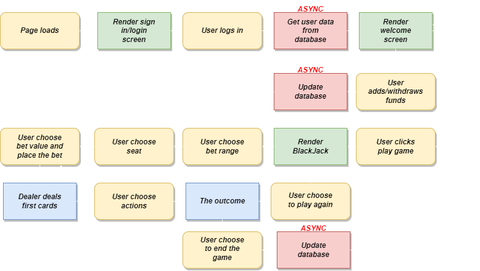
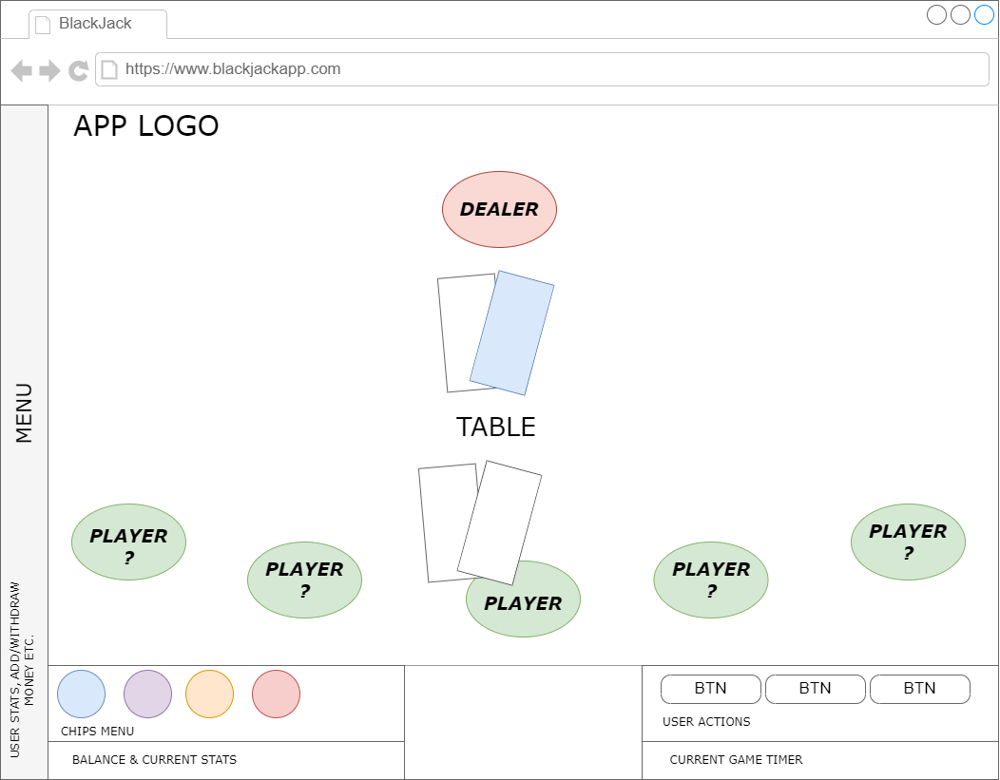

# Evolution-Course-Project-BlackJack

Evolution TypeScript Bootcamp final project, BlackJack - classic casino game of luck and strategy.

# Game rules

-   Players are playing against the dealer.
-   The goal is to have a stronger hand than the dealer without going over 21.
-   Number cards (2-10) count as face value, Aces count as either 1 or 11, and Kings, Queens, and Jacks count as 10.
-   The dealer is dealt two cards, and the player is dealt two cards.
-   The player's cards are dealt face-up, while only the dealer's first card is shown.
-   Player can decide to Hit, Double, Split, or Stand.
-   If player hand is closer to 21 than the dealer's hand without going over, player wins.
-   If the dealer's hand is closer to 21 without going over, player lose.
-   The dealer must stand on 17 or higher, and draw cards to 16.
-   Hands of equal value to the dealers are a push, and players bet is returned.
-   If players hand is 22 or higher (busted), player lose regardless of the value of the dealer's hand.
-   Player hand automatically stands when it has a value of 21

# **PROJECT PLAN**

## **1. USER STORIES**

_(Description of the app functionality, form a user perspective, from highest to lowest priority)_

-   **As a user, I want to play classic BlackJack.**
-   **As a user, I want to track current bet value, total win value.**
-   **As a user, I want to track my wallet balance in real time.**
-   **As a user, I want to track how much time spent on the game.**
-   As a user, I want to save a log of all of my games in my account (nice to have).
-   As a user, I want to keep my balance saved in my account (nice to have).
-   As a user, I want to choose a seat (nice to have).
-   As a user, I want to set min/max bets before the game (nice to have).
-   As a user, I want to add/withdraw founds.

## **2. FEATURES**

| USER STORIES                                                                                                                    | FEATURES                                                                                                                                                                                                                                                       |
| ------------------------------------------------------------------------------------------------------------------------------- | -------------------------------------------------------------------------------------------------------------------------------------------------------------------------------------------------------------------------------------------------------------- |
| As a user, I want to save a log of all of my games in my account. As a user, I want to keep my balance saved in my account. | - Basic statistic no. of games, % of wins, % of loses.  - **MVP:** Local storage (**Nice to have:** Firebase to store all necesary data).  - **MVP:** Local storage (**Nice to have:** Firebase Auth REST API to perform users authentication).        |
| As a user, I want to add/withdraw money.                                                                                        | **- DUMMY OPTION, no real payment method will be implemented.**  - Balance storend in local state. - Basic form to add/subtract desirable amount from total balance value. - (**Nice to have:** Updates Firebase data when user leaves the table). |
| As a user, I want to choose a seat                                                                                              | - **MVP:** Only one seat will be available, seat will be automatically chosen (**Nice to have:** user can select any given seat).                                                                                                                              |
| As a user, I want to set min/max bets before the game                                                                           | - **MVP:** Constant values of min/max bets (**Nice to have:** user can select bets range before joining the game).                                                                                                                                             |
| As a user, I want to track current bet value, total win value.                                                                  | - Current game data stored in state.                                                                                                                                                                                                                           |
| As a user, I want to track how much time spent on the game.                                                                     | - Timer function value stored in state. Current valaue displayed on the screen                                                                                                                                                                                 |
| As a user, I want to play classic BlackJack.                                                                                    | - **MVP:** Implementation basic rules according [BlackJack](https://en.wikipedia.org/wiki/Blackjack)                                                                                                                                                           |

## **3. APP FLOWCHART**

## **4. APP COMPONENTS**

_(APP basic structure)_

### **APP:**

1. Table - container:
    - User seat:
        - User cards.
        - User actions (**Hit, Stand, Double down)**.
        - User score - current game.
        - Users wallet balance - total amount.
        - Chips menu:
            - $5 Chip.
            - $10 Chip.
            - $25 Chip.
            - $50 Chip.
            - $100 Chip.
    - Dealer seat:
        - Dealer cards.
2. Side menu:
    - Add/withdraw money - menu.
    - Actions - leave game.
3. Timer (game time)

## **5. APP WIREFRAME**

_(Desktop)_

# Getting Started with Create React App

This project was bootstrapped with [Create React App](https://github.com/facebook/create-react-app).

## Available Scripts

In the project directory, you can run:

### `npm start`

Runs the app in the development mode.\
Open [http://localhost:3000](http://localhost:3000) to view it in the browser.

The page will reload if you make edits.\
You will also see any lint errors in the console.

### `npm test`

Launches the test runner in the interactive watch mode.\
See the section about [running tests](https://facebook.github.io/create-react-app/docs/running-tests) for more information.

### `npm run build`

Builds the app for production to the `build` folder.\
It correctly bundles React in production mode and optimizes the build for the best performance.

The build is minified and the filenames include the hashes.\
Your app is ready to be deployed!

See the section about [deployment](https://facebook.github.io/create-react-app/docs/deployment) for more information.

### `npm run eject`

**Note: this is a one-way operation. Once you `eject`, you can’t go back!**

If you aren’t satisfied with the build tool and configuration choices, you can `eject` at any time. This command will remove the single build dependency from your project.

Instead, it will copy all the configuration files and the transitive dependencies (webpack, Babel, ESLint, etc) right into your project so you have full control over them. All of the commands except `eject` will still work, but they will point to the copied scripts so you can tweak them. At this point you’re on your own.

You don’t have to ever use `eject`. The curated feature set is suitable for small and middle deployments, and you shouldn’t feel obligated to use this feature. However we understand that this tool wouldn’t be useful if you couldn’t customize it when you are ready for it.

## Learn More

You can learn more in the [Create React App documentation](https://facebook.github.io/create-react-app/docs/getting-started).

To learn React, check out the [React documentation](https://reactjs.org/).
